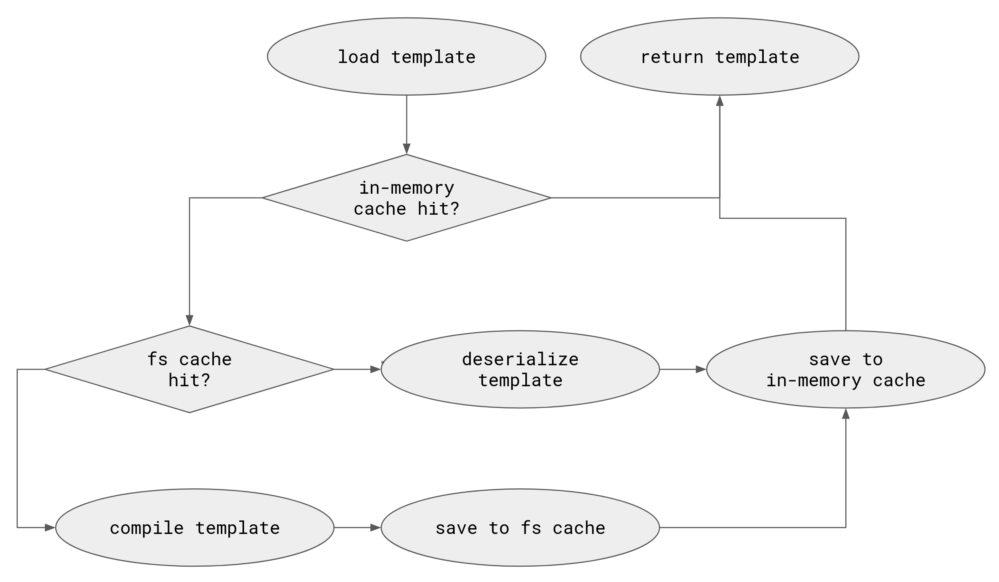

# KTemplate Architecture

## Template load pipeline



When `Engine::load` is called, this is what happens under the hood:

1. Chech whether our request-local in-memory cache already contains a compiled template. It's a simple array lookup using the resolved **template path** as a key. If it's there, return that.

2. Otherwise check if `Context::cache_dir` is set. In that case, check whether that directory contains the serialized template object. If such file is found, load it, save it to the in-memory cache and return the freshly created template.

3. Otherwise compile the template. Save results to the in-memory cache. If `Context::cache_dir` is set, serialize the template for future use (this will be useful during the next request).

## KTemplate opcodes

The templates are compiled to a specialized bytecode-like form that is then executed by the interpreter.

Every instruction occupies an entire PHP `int` type, so it's not exactly a bytecode; although the **opcode** part always fits in 8 bits. We call this `int` value an **opdata**. An opdata is a representation of one VM **instruction**.

This expression always extracts the opcode part of opdata: `$opdata & 0xff`.

Depending on the opcode, there could be more instruction arguments encoded inside **opdata**. Most of the arguments occupy 8 bits, but some of them take 16 bits.

For example, const indexes (IDs) are 16-bits wide to allow values up to `0xffff`. Jump offsets are also 16-bits to make it possible to jump further.

Lets take a look at `JUMP_FALSY` instruction encoding.

```
0x29 pcdelta:rel16 cond:rslot
```

`0x22` is an opcode, then we have a 16-bit argument of relative jump target, plus a second argument - a jump condition in form of a frame slot index.

To unpack all the arguments, we apply bitwise operations:

```php
$opdata = $code[$pc]; // Extract the current instruction opdata
$op = $opdata & 0xff;
$rel16 = ($opdata >> 8) & 0xffff;
$cond_slot = ($opdata >> 24) & 0xff;
```

Then we can implement this operation inside the interpreter like so:

```php
if (!$state->slots[$cond_slot]) {
    $pc += $rel16;
}
```

It's important to keep in mind that there can be no single instruction that exceeds 64 bits.

The `Op.php` contains all KTemplate instructions info. This file is generated by `_script/gen_opcodes/main.go`. To add a new instruction or modify the existing one, change the generator, not the generated file.
